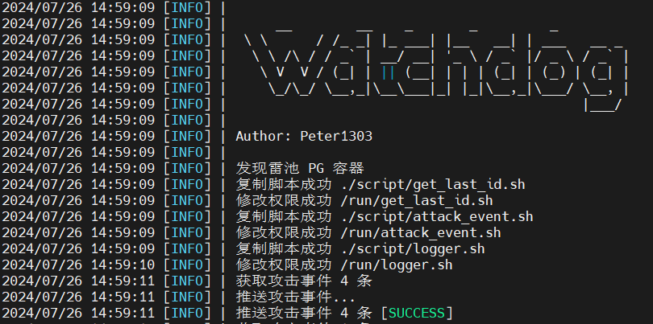

## 介绍

雷池攻击事件看门狗



雷池攻击事件看门狗是一个用于监控雷池攻击事件的软件

灵感来自于 [https://www.freebuf.com/articles/es/399740.html](https://www.freebuf.com/articles/es/399740.html)

简单来说就是通过在数据库执行脚本来输出雷池记录攻击事件，然后通过 `Python` 来解析并推送事件

# 配置

启动之后可以在 `config/config.yml` 中配置：

```yaml
server:
  header:
    # Header 的主机信息
    host: xxx
  # 指定推送的 API 地址（可选）
  host: http://localhost
  # 端口（可选）
  port: 9080
  # 推送路径（可选）
  path: 
```

# 运行环境

- Python 3
- pyyaml >= 6.0.1
- requests >= 2.32.3

# 运行

## 安装依赖

```bash
pip3 install -r requirements.txt
```

## 执行

```bash
python3 main.py
```

# 推送参数

- 方法 POST

| 参数        | 类型  | 说明                        |
|-----------|-----|---------------------------|
| `id`      | 整数  | 事件 ID                     |
| `time`    | 字符串 | 格式如 `2024-07-26 06:36:05` |
| `from`    | 字符串 | 攻击来源                      |
| `ip`      | 字符串 | IP 地址                     |
| `target`  | 字符串 | 攻击目标                      |
| `path`    | 字符串 | 攻击路径                      |
| `rule_id` | 字符串 | 规则 ID                     |

## 示例

```json
[
    {
        "time": "2024-07-26 03:17:33",
        "from": "上海市上海市",
        "ip": "58.34.1.19",
        "target": "8.8.8.8:9080",
        "path": "/service/extdirect",
        "rule_id": "m_rule/33e75ff09dd601bbe69f351039152189",
        "id": 4934902
    }
]
```
